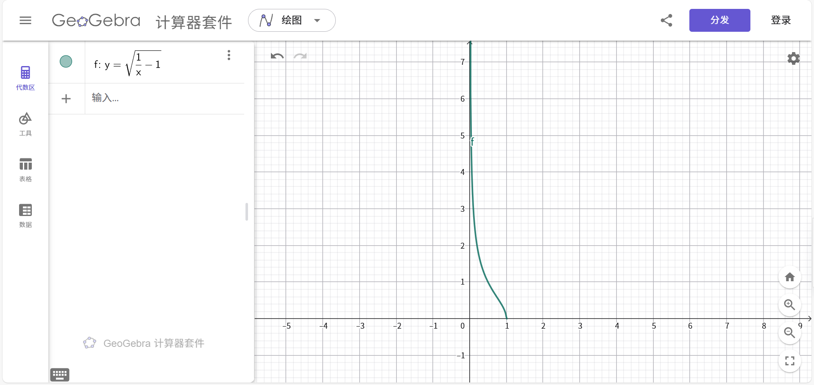
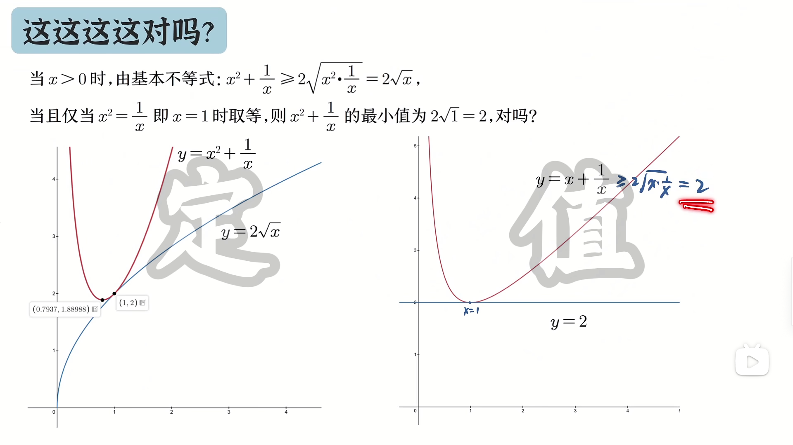

# 求函数值域的常用方法
警告:部分Android平台的浏览器不支持显示数学公式,建议使用Windows/任一Linux发行版上的浏览器观看,MacOS/iOS/BSD未测试
### 直接法

例:求 $f(x)=\frac{1}{x^2+1}$ 的值域

${x^2\geq0}\Rightarrow{x^2+1\geq1}\Rightarrow{0<\frac{1}{x^2+1}\leq{1}}$

### 逆求法

例:求 $f(x)=\frac{1}{x^2+1}$ 的值域
设 $y=f(x)$ ,将$x$用$y$表示(不准确地说,将$x$看作因变量)
此时相当于求 $f^{-1}(y)=\sqrt{\frac{1}{y}-1}$ 的定义域(即 $y=f(x)$ 的反函数的定义域),则有
$$
{\frac{1}{y}-1}\geq0
$$
<small>注:$f(x)$为偶次根式型函数时,定义域为使被开方数非负的实数的集合</small>
如图
$$
0<y\leq1
$$
### 图象法
易作出函数图象的函数,根据图象求值域.
如给定定义域的二次函数通过顶点式作图求值域.
### 换元法
形如 $y=ax+b\pm\sqrt{cx+d}$ ($a$,$b$,$c$,$d$均为常数,$ac\neq0$) 的函数常用此法
设$\sqrt{cx+d}=t\geq0$,则此函数必定能被表示成关于$t$的二次函数,从而通过图象法求出函数的值域
<small>前面的次数是 $1$ ,后面的次数是 $\frac{1}{2}$ ,把 $\frac{1}{2}$ 次的设成 $1$ 次,那前面的不就变成 $2$ 次了吗,所以要设次数小的</small>
### 分离常数法
对于形如 $y=\frac{cx+d}{ax+b}$ 的函数,将$\frac{cx+d}{ax+b}$变形为$\frac{\frac{c}{a}(ax+b)+d-\frac{bc}{a}}{ax+b}=\frac{c}{a}+\frac{d-\frac{bc}{a}}{ax+b}$ ,再结合$x$的取值范围确定$\frac{d-\frac{bc}{a}}{ax+b}$的取值范围,从而确定函数的值域.
<small><small>这里变形用的是配凑法,十分不直观,咱们可以把$ax+b$设成$t$,再用$t$表示$x$,将它代回$\frac{cx+d}{ax+b}$,也能得到上面那一坨,其实就是换元法啦Ciallo～(∠・ω< )⌒★</small></small>
### 均值不等式法
没啥好说的,就是利用均值不等式,但要注意下图这种情况

<small>Copyright 2025.10.19 cherry-universe All rights reserved.</small>